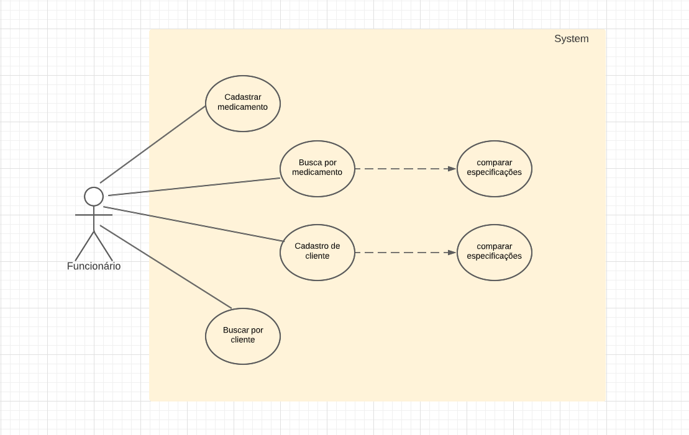
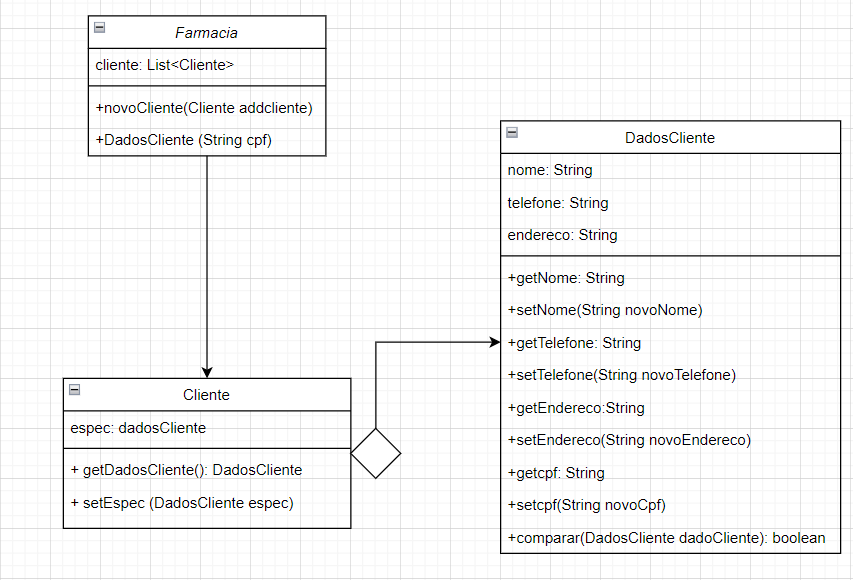
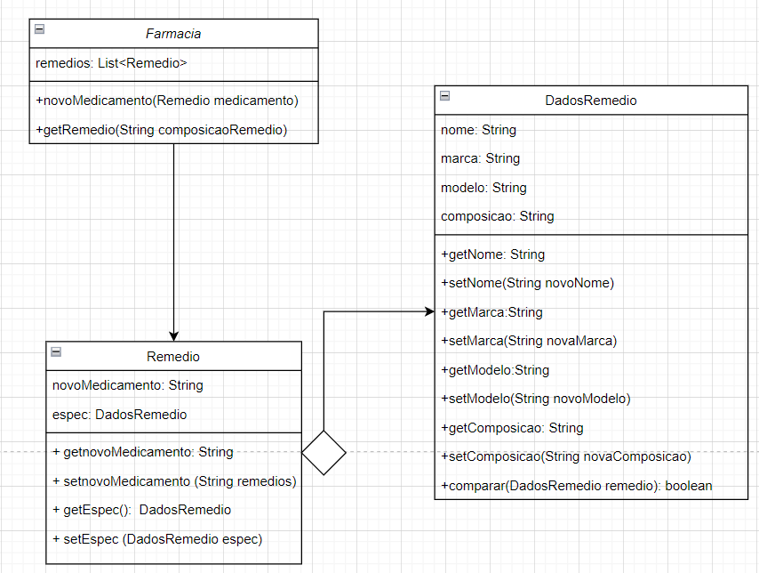
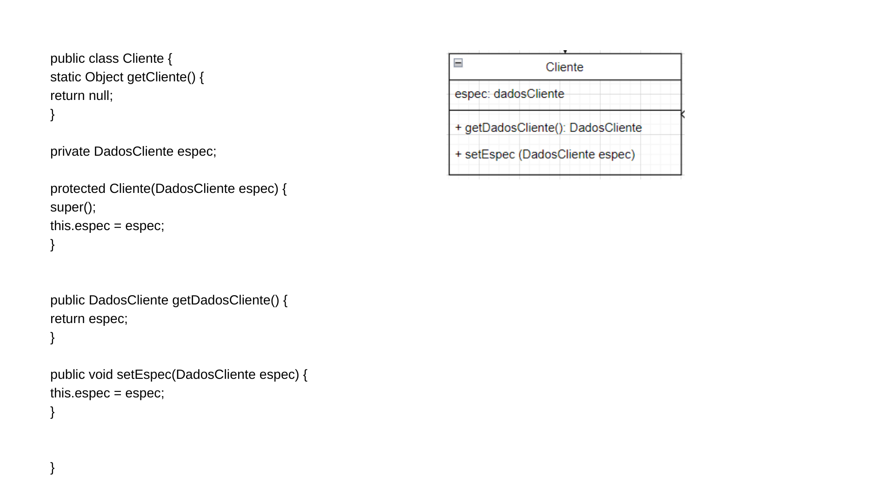
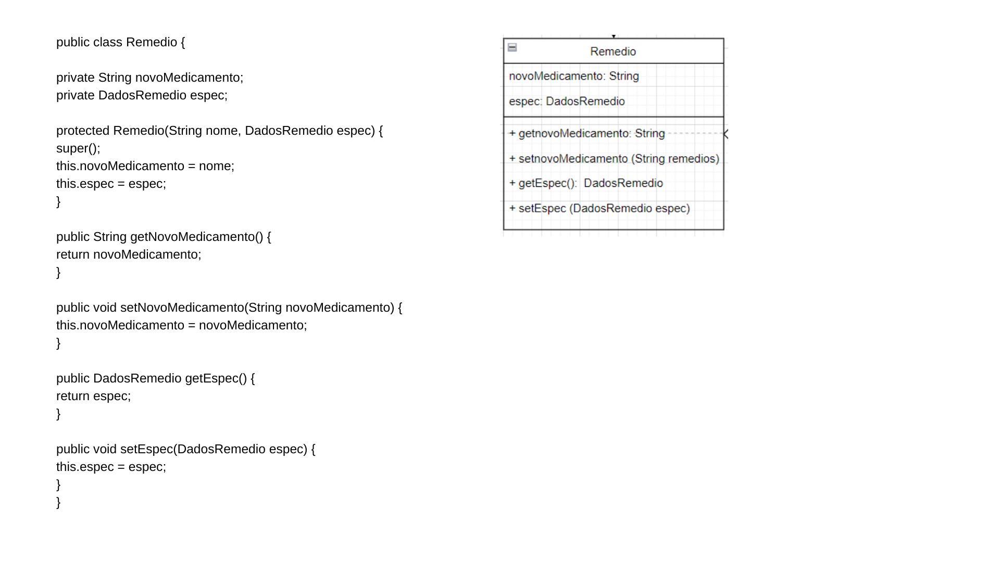
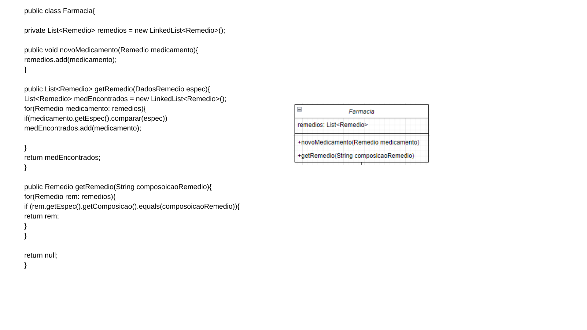
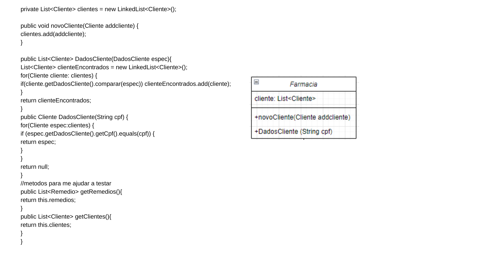
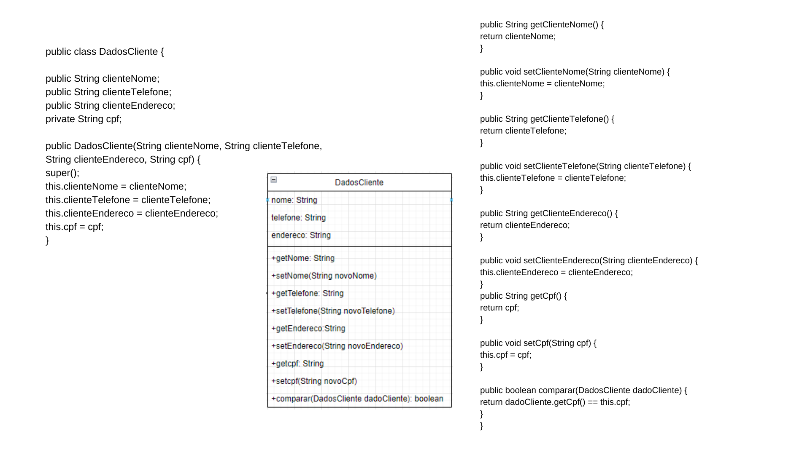
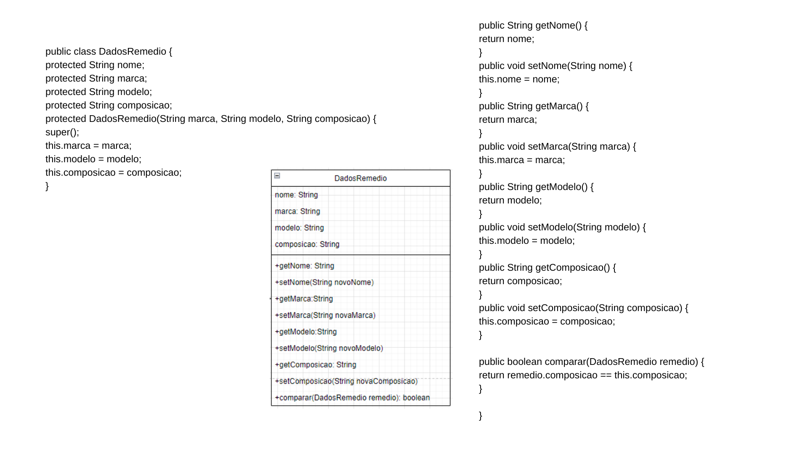

# Engenharia de Software 

>"We see three critical differences between programming and software engineering: time, scale, and the trade-offs at play. On a software engineering project, engineers need to be more concerned with the passage of time and the eventual need for change. In a software engineering organization, we need to be more concerned about scale and efficiency, both for the software we produce as well as for the organization that is producing it. Finally, as software engineers, we are asked to make more complex decisions with higher-stakes outcomes, often based on imprecise estimates of time and growth. Within Google, we sometimes say, “Software engineering is programming integrated over time.” Programming is certainly a significant part of software engineering: after all, programming is how you generate new software in the first place. If you accept this distinction, it also becomes clear that we might need to delineate between programming tasks (development) and software engineering tasks (development, modification, maintenance). The addition of time adds an important new dimension to programming. Cubes aren’t squares, distance isn’t velocity. Software engineering isn’t programming."  Titus Winters, Software Engineering at Google

A engenharia de software está focada em ir além do código. Ela mantém seu foco em todos os aspectos da produção de software, em seu desempenho através do tempo e em evitar empecilhos na necessidade de mudanças e manutenções. Ela está sempre presente desde a coleta de requisitos com o cliente, passando pelos processos de desenvolvimento e seguindo até a validação e evolução do software. 

# Atividade de requisitos 

[Link](https://docs.google.com/presentation/d/1GMds68vXowb3h_GFtI3fwKeXJQQJjm7L-wL0BJhIfLI/edit#slide=id.p7) dos slides das aulas

- Coletar os requisitos funcionais e não-funcionais de um sistema.
- Requisitos são as necessidades do cliente
- Funcionais: são tarefas ou ações do sistema
- Não-funcionais: são qualidades do sistema

## Software: gerenciamento de farmacia

### Requisitos funcionais:
- Cadastro de paciente
- Cadastro de medicamentos
- Busca por medicamentos
- Cadastro de funcionários

### Requisitos não funcionais:
- Sistema desktop
- Execução rápida
- Sistema integrado com outras aplicações 
- Sistema conectado a um banco de dados
- Interface simples e minimalista

# 
<h1 align="center">Casos de uso</h1>

  

<h1 align="center"> Diagrama de classes</h1> 

  
  

<h1 align="center">Codigos e seus diagramas</h1>

  
  
  
  
  
  

