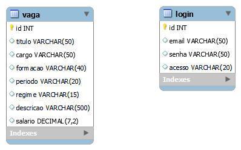
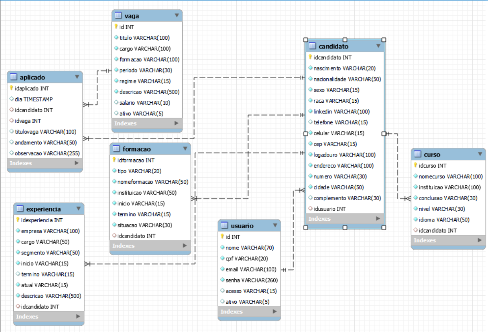

# Pro4Tech - Projeto de RH
<div align="center"> 

</div>

Desenvolvimento de um projeto em parceria com a Pro4Tech, empresa especializada em soluções de software personalizadas. O objetivo foi criar um sistema de gerenciamento de vagas para Recursos Humanos, com foco em cruzar dados de candidatos com vagas disponíveis e gerar relatórios detalhados para facilitar as decisões do RH. O sistema abrange funcionalidades como:
- Cadastro de vagas e candidatos.
- Aplicação de candidatos a vagas específicas.
- Gerenciamento de vagas com atributos customizáveis.
- Acompanhamento do status das candidaturas pelos candidatos.
- Geração de relatórios para o RH.

[link para o GIT](https://github.com/OsReservas/Project-RH) <br />

**Tecnologias Utilizadas**
- Java <br />
- Eclipse <br />
- MySQL <br />
- Github <br />
- Figma <br />

# Contribuições Pessoais
Minhas contribuições se concentraram principalmente na criação e documentação do banco de dados. Fui responsável por desenvolver os modelos lógico e conceitual, garantindo que a estrutura estivesse alinhada às necessidades funcionais do sistema. Além disso, atuei fortemente na documentação do projeto, registrando de forma detalhada os diagramas, decisões técnicas e etapas do desenvolvimento.

Também colaborei com a equipe para integrar o banco de dados às funcionalidades principais, como o gerenciamento de candidatos e vagas, e assegurei que todas as operações fossem otimizadas e bem estruturadas. Meu foco esteve em criar uma base sólida e organizada, tanto no aspecto técnico quanto no documental, facilitando o trabalho do time e a manutenção futura do sistema.  <br />

<details>




```
create database bancotech;
CREATE TABLE login(
id int not null auto_increment primary key,
email varchar(50) unique, 
senha varchar(50),
acesso varchar(20)
);
CREATE TABLE vaga(
id int not null auto_increment primary key,
titulo    varchar (50),
cargo     varchar(50),
formacao  varchar(40),
periodo   varchar (20),
regime    varchar(15),
descricao varchar (500),
salario   decimal(7,2)
);
```
```
DROP TABLE IF EXISTS `aplicado`;
/*!40101 SET @saved_cs_client     = @@character_set_client */;
/*!50503 SET character_set_client = utf8mb4 */;
CREATE TABLE `aplicado` (
  `idaplicado` int NOT NULL AUTO_INCREMENT,
  `dia` timestamp NULL DEFAULT CURRENT_TIMESTAMP,
  `idcandidato` int DEFAULT NULL,
  `idvaga` int DEFAULT NULL,
  `titulovaga` varchar(50) DEFAULT NULL,
  PRIMARY KEY (`idaplicado`),
  KEY `idcandidato` (`idcandidato`),
  KEY `idvaga` (`idvaga`),
  CONSTRAINT `aplicado_ibfk_1` FOREIGN KEY (`idcandidato`) REFERENCES `candidato` (`idcandidato`),
  CONSTRAINT `aplicado_ibfk_2` FOREIGN KEY (`idvaga`) REFERENCES `vaga` (`id`)
) ENGINE=InnoDB DEFAULT CHARSET=utf8mb4 COLLATE=utf8mb4_0900_ai_ci;
/*!40101 SET character_set_client = @saved_cs_client */;
```
```
CREATE TABLE `candidato` (
  `idcandidato` int NOT NULL AUTO_INCREMENT,
  `nascimento` varchar(20) DEFAULT NULL,
  `nacionalidade` varchar(20) DEFAULT NULL,
  `sexo` varchar(15) DEFAULT NULL,
  `raca` varchar(15) DEFAULT NULL,
  `linkedin` varchar(50) DEFAULT NULL,
  `telefone` varchar(15) DEFAULT NULL,
  `celular` varchar(15) DEFAULT NULL,
  `cep` varchar(10) DEFAULT NULL,
  `logadouro` varchar(10) DEFAULT NULL,
  `endereco` varchar(50) DEFAULT NULL,
  `numero` varchar(30) DEFAULT NULL,
  `cidade` varchar(50) DEFAULT NULL,
  `complemento` varchar(30) DEFAULT NULL,
  `idusuario` int DEFAULT NULL,
  PRIMARY KEY (`idcandidato`),
  UNIQUE KEY `celular` (`celular`),
  KEY `idusuario` (`idusuario`),
  CONSTRAINT `candidato_ibfk_1` FOREIGN KEY (`idusuario`) REFERENCES `usuario` (`id`)
)
```

</details>


**Hard Skills Efetivamente Desenvolvidas**
| Tecnologia | Classificação |
| --- | --- |
| Java | ★★★★★★★★☆☆ |
| MySQL | ★★★★★★★★☆☆ |
| Figma | ★★★★★★★★★★ |

**Soft Skills Efetivamente Desenvolvidas**
| Habilidade | Descrição |
| --- | --- |
| Resiliência | ★★★★★★★★★☆ |
| Comunicação Assertiva | ★★★★★★★☆☆☆ |
| Empatia | ★★★★★★★★★☆ |
