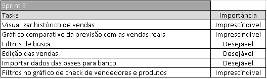

# Dom Rock  
<div align="center"> 

</div>

Desenvolvimento de soluções baseadas em ciência de dados e automação para simplificar processos corporativos em parceria com a empresa Dom Rock. O desafio consiste em lidar com o histórico de movimentação de produtos (vendas e estoque), predição de faturamento (feito por um algoritmo de IA já existente) e a entrada de dados oriundas da força de vendas quanto ao planejamento futuro. 

[link para o GIT](https://github.com/Thunder53/Dom-Rock) <br />

**Tecnologias Utilizadas**
- Java <br />
- Eclipse <br />
- MySQL <br />
- Github <br />
- Figma <br />

# Contribuições Pessoais
- Desenvolvimento de funcionalidades de front-end: Contribuí para o design e desenvolvimento da interface de usuário, criando elementos como a navbar com Bootstrap e telas para registro de vendas e exibição de vendas realizadas.
- Melhoria na usabilidade do sistema: Trabalhei na correção e aprimoramento de funcionalidades, como ajuste de botões e melhorias nos gráficos, visando uma experiência mais intuitiva e eficiente para o usuário.

<details>

```
<!DOCTYPE html>
<html lang="pt-br">
<head>
    <meta charset="UTF-8">
    <meta http-equiv="X-UA-Compatible" content="IE=edge">
    <meta name="viewport" content="width=device-width, initial-scale=1.0">
    <link rel='stylesheet' href='https://maxcdn.bootstrapcdn.com/bootstrap/3.2.0/css/bootstrap.min.css'>
    <link rel='stylesheet' href='https://cdn.oesmith.co.uk/morris-0.5.1.css'>
    <link rel="stylesheet" href="../styles css/adminCharts.css">
    <title>Dom Rock</title>
</head>
<body>
    <header class="cabecalho">
        
        <nav class="cabecalho__nav">
            <a class="cabecalho__home"  href="">Home</a>
            <a class="cabecalho__home"  href="adminCharts.html">Dashboard</a>
            <a class="cabecalho__home"  href="formCliente.html">Cadastro</a>
        </nav>
    </header>
    <br>
    <div class"row">
        <div class="col-sm-6 text-center">
          <label class="label label-success">Area Chart</label>
          <div id="area-chart" ></div>
        </div>
        <div class="col-sm-6 text-center">
           <label class="label label-success">Line Chart</label>
          <div id="line-chart"></div>
        </div>
    </div>
    <br>
    <div class="row">
        <div  class="col-sm-6 text-center">
           <label class="label label-success">Bar Chart</label>
          <div id="bar-chart" ></div>
        </div>
        <div class="col-sm-6 text-center">
           <label class="label label-success">Bar stacked</label>
          <div id="stacked" ></div>
        </div>
    </div>
</body>
<script src='https://ajax.googleapis.com/ajax/libs/jquery/1.9.0/jquery.min.js'></script>
<script src='https://cdnjs.cloudflare.com/ajax/libs/raphael/2.1.2/raphael-min.js'></script>
<script src='https://cdnjs.cloudflare.com/ajax/libs/morris.js/0.5.0/morris.min.js'></script>
<script src="../js/chartAdmin.js"></script>
</html> 
```
```
var ctxL = document.getElementById("lineChart").getContext('2d');
var myLineChart = new Chart(ctxL, {
  type: 'line',
  data: {
    labels: ["January", "February", "March", "April", "May", "June", "July"],
    datasets: [{
      label: "My First dataset",
      data: [65, 59, 80, 81, 56, 55, 40],
      backgroundColor: [
        'rgba(105, 0, 132, .2)',
      ],
      borderColor: [
        'rgba(200, 99, 132, .7)',
      ],
      borderWidth: 2
    },
    {
      label: "My Second dataset",
      data: [28, 48, 40, 19, 86, 27, 90],
      backgroundColor: [
        'rgba(0, 137, 132, .2)',
      ],
      borderColor: [
        'rgba(0, 10, 130, .7)',
      ],
      borderWidth: 2
    }
    ]
  },
  options: {
    responsive: true
  }
});
```
```
fetch("http://localhost:8080/venda/acima-meta")
.then(function (response) {
    return response.json();
  })
  .then(function (data) {
    var dados = data.map(function (item) {
      return { y: item.quant_vendida, a: item.fk_usuario_id };
    });
    var config = {
      data: dados,
      xkey: "y",
      ykeys: "a",
      labels: ["Total"],
      fillOpacity: 0.6,
      hideHover: "auto",
      behaveLikeLine: true,
      resize: true,
      pointFillColors: ["#ffffff"],
      pointStrokeColors: ["black"],
      lineColors: ["blue"],
    };
    config.element = "stacked";
    config.stacked = true;
    Morris.Bar(config);
  })
  .catch(function (error) {
    console.log(error);
  });
```
```
 fetch(`http://localhost:8080/venda/vendedorHistorico/${localStorage.getItem('id')}`)
  .then(function (response) {
    return response.json();
  })
  .then(function (data) {
    console.log(data)
    var dados = data.map(function (item) {
      return { y: item.quant_estimada, a: item.quant_vendida };
    });
    var config = {
      data: dados,
      xkey: "y",
      ykeys: "a",
      labels: ["Quantidade estimada","Quantidade vendida"],
      fillOpacity: 0.6,
      hideHover: "auto",
      behaveLikeLine: true,
      resize: true,
      pointFillColors: ["#ffffff"],
      pointStrokeColors: ["black"],
      lineColors: ["blue"],
    };
    config.element = "historico";
    config.stacked = true;
    Morris.Bar(config);
  })
  .catch(function (error) {
    console.log(error);
  });
```

</details>


- Documentação e organização: Fiz várias atualizações na documentação do projeto, garantindo que os detalhes do desenvolvimento estivessem claros e acessíveis para a equipe, além de adicionar diagramações para melhor visualização dos fluxos.
- Ajustes na lógica de negócios: Atualizei e mantive registros importantes, garantindo que as métricas estivessem sempre atualizadas e com informações relevantes para a análise do progresso do projeto.
- Aprimoramento contínuo do projeto: Durante o desenvolvimento, fiz ajustes em diversas áreas do código e dos fluxos do front-end, como mudanças nas visualizações e melhorias no código JavaScript, buscando sempre otimizar o desempenho e a clareza do sistema.  <br />

<details>





</details>


**Hard Skills Efetivamente Desenvolvidas**
| Tecnologia | Classificação |
| --- | --- |
| Java | ★★★★★★★☆☆☆ |
| Javascript | ★★★★★★★★★☆ |
| MySQL | ★★★★★★★★☆☆ |
| Figma | ★★★★★★★★★★ |

**Soft Skills Efetivamente Desenvolvidas**
| Habilidade | Descrição |
| --- | --- |
| Resiliência | ★★★★★★★★★☆ |
| Comunicação Assertiva | ★★★★★★★☆☆☆ |
| Empatia | ★★★★★★★★★☆ |
